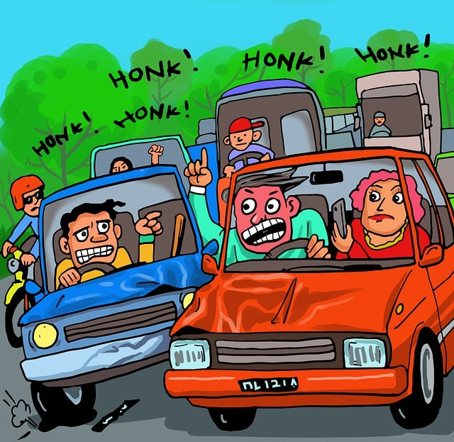
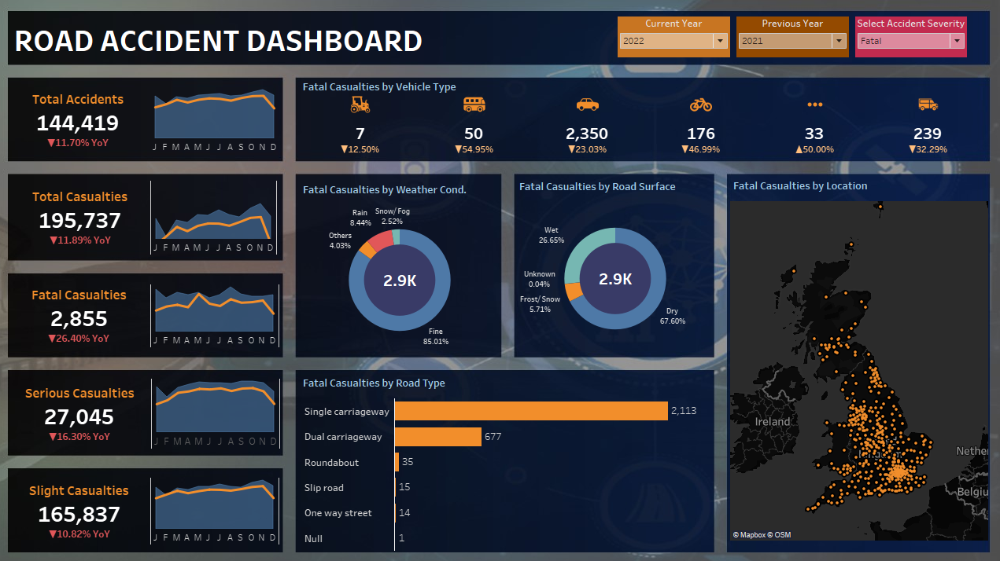
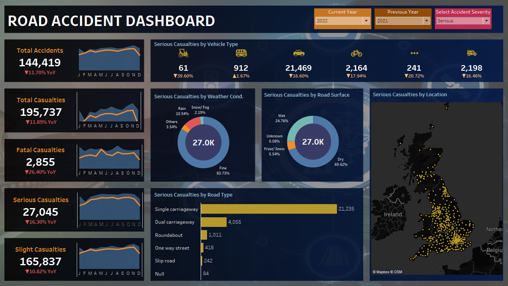
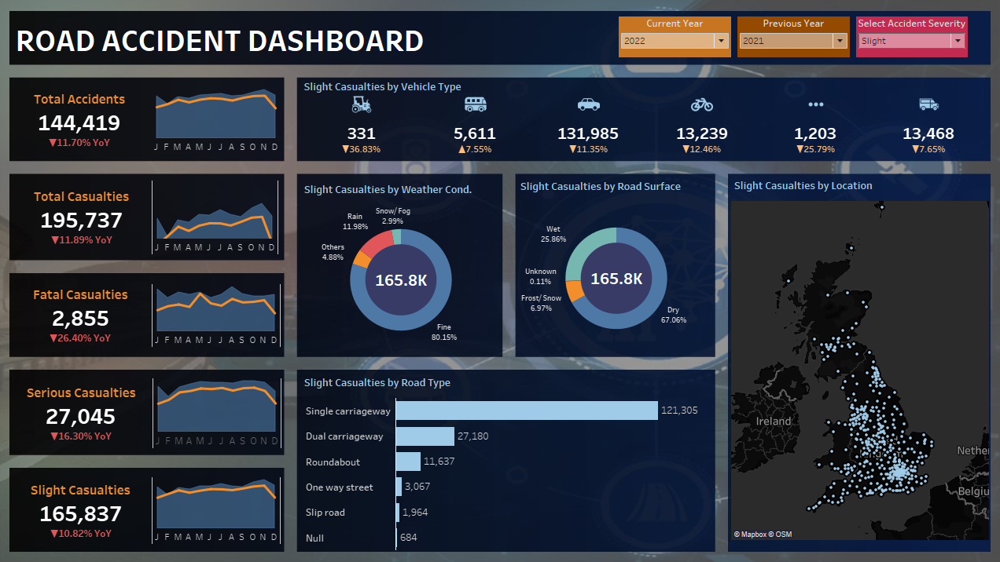
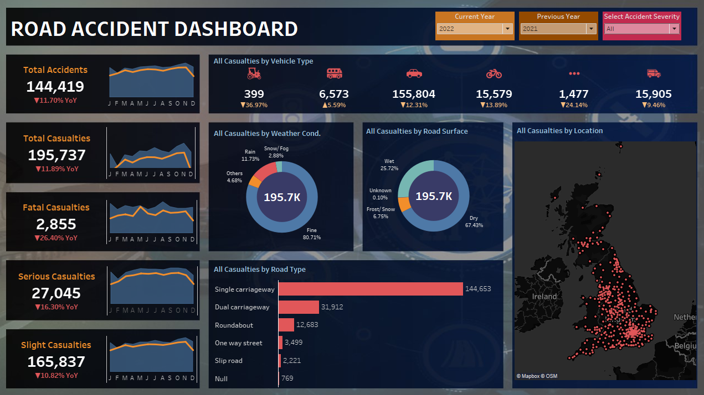

# Road-Accident-Analysis

## Table of contents
- [Project Overview](#project-overview)
   - [Goal](#goal)
- [KPI Analysis](#kpi-analysis)
- [Findings](#findings)
- [Recommendations](#recommendations)
- [Conclusion](#conclusion)

---

## Project Overview

Road accidents are a global problem, resulting in millions of deaths and injuries every year. According to the World Health Organization, approximately 1.35 million people lose their lives in road traffic accidents annually, and between 20 and 50 million more suffer non-fatal injuries. These accidents are not only a leading cause of death but also a significant source of physical and psychological trauma for victims and their families. 

This project analyzes data on traffic accidents and detects patterns and valuable information concerning the people harmed, explores factors that contribute to road accidents and discusses some possible prevention strategies. The project will utilize various essential metrics known as key performance indicators (KPIs) to assess the severity and consequences of traffic accidents. These KPIs will include the overall number of casualties based on accident severity, vehicle type, road surface and other relevant factors. I have carried out this project utilizing Tableau desktop.

### Goal

The goal of this project is to analyze road accident data and cover significant patterns and valuable insights regarding casualties. So that the project seeks to provide essential information shaping policies and making informed decisions regarding road safety which ultimately aims to contribute to the reduction of casualties resulting from accidents.

  
## KPI Analysis
The total casualties by accident severity for current year and year-on-year growth in fatal casualties, serious casualties, and slight casualties.

*Fatal Casualties*

 The total number of casualties that led to death are 2,855, leading to year-on-year decrease of 26%.

*Serious Casualties*

There are total number of 27,045 people who sustained serious injury, and the road accident with respect to last year decreases to 16%.

*Slight Casualties*

 165,837 people sustained minor injuries and the year-on-year casualties with respect to last year drops to 10%.

[ <a href="#table-of-contents">↑ Back to top ↑</a> ]

      
            
## Findings

Factors of Casualties

The Total Accident and Casualties are 144,419 and 195,737 respectively, when comparing 2022 to 2021, the year of growth of accident decreased to 11% respectively. This means if the year-on-year total accident is decreasing, accidents are also decreasing.

- *Casualties by Vehicle type*: Car is one vehicle type which creates the maximum number of accident and that is why their number of casualties are very high compared to other vehicle type.

- *Casualties by Weather condition*: 80% of casualties occurred during the Fine weather condition. Rain and snow influence speed reduction and reduces the probability of fatal crash, and the possible reason is that drivers travel more cautiously.

- *Casualties by Road surface*: 67% of casualties occurred in dry surface. The risk of casualties in dry roads are more dangerous than frost/snow roads and wet roads. Drivers and riders were more likely to suffer severe injury whilst driving on completely dry roads than they were on wet roads.

- *Casualties by Road type*: Out of all the road type, single carriageway has the highest casualties; It has more than 73% of accident. The overall risk of death and serious injury to road-users is much greater on single-carriageway than dual carriageway.

- *Casualties by Location*: Barnet recorded the highest number of casualties.

## Recommendations

While each 
The risk of accidents can be controlled at several levels.

- Infrastructure 

The design of roads can have a considerable impact on users’ safety. Ideally, roads should be designed keeping in mind the safety of all road users. This would mean making sure that there are adequate facilities for pedestrians, riders, and drivers. Measures such as footpaths, cycling lanes, safe crossing points, and other traffic calming measures can be critical to reducing the risk of casualty among these road users. 

Hazard locations and inadequate road designs have been considered as critical areas because of its geometrical design as well as surface friction, however, frequent accidents tend to be higher at these sections than at the normal. According to casualties by road type, single carriageway has the highest number of road accidents, therefore, the government or other board need to take action to convert the road into double lane, construct good roads, streetlights, and signs. In this way, they can reduce the high risk of accidents per year.

- Traffic Laws and Driving Rules

Once the infrastructure is well established, Traffic laws and driving rules can be implemented very strictly with hefty fines. Studies have proven time and time again that drivers are more likely to abide by the rules if they fear punishment and less likely to if they believe they can get aware with it. Traffic laws and rules such as speeding, illegal parking, failure to stop at a "STOP" sign, driving with a broken headlight, driving under the influence (DUI), use of seatbelts and motorcycle helmets, and child restraints laws are enforced to keep roads safe. When drivers break traffic laws, they put themselves and others at risk. However, if laws like fine and a permanent or temporary driving ban are strictly enforced, 90% of accidents can be avoided. Increasing the number of sobriety checkpoints can help reduce the number of drunk drivers on the road.

- Awareness

Government should conduct awareness programs on road safety and traffic rules with the cooperation from local bodies, organizations (such as schools, driver unions, companies, religious organizations), and by making road safety information accessible. Ignorance of road users can contribute to accidents, for example, a person driving with a high beam light blinds the incoming traffic and increases the risk of accident. Overtaking on narrow roads and turns is dangerous to the driver as well as the incoming traffic.

## Conclusion

Road accidents are a tragic, preventable phenomenon that causes immeasurable pain and loss. By understanding the diverse causes of these accidents and implementing targeted interventions, it is possible to significantly reduce their frequency and impact. The commitment to road safety must be a shared responsibility among individuals, communities, and governments to create safer roads for all.

        
 
[ <a href="#table-of-contents">↑ Back to top ↑</a> ]

                        

